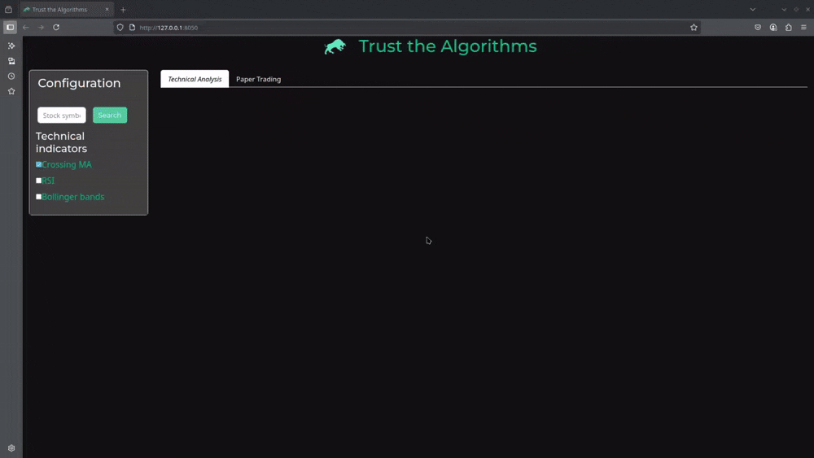

# vTrade: Trust the Algorithms

The standard 50-day and 200-day Simple Moving Average (SMA) combination doesn't work for every stock.That's where vTrade comes in. Powered by a blazing-fast Rust processor, vTrade lets traders quickly backtest countless technical indicator parameter combinations to find the absolute best settings for any given stock, ultimately boosting performance.

https://github.com/viettran295/strategy-processor



## Features

- **Current support technical indicators**:
  - Moving Average crossover strategies (SMA, EMA)
  - RSI (Relative Strength Index) analysis
  - Bollinger Bands analysis

## Installation

Docker Deployment

1. Build and run with Docker Compose
   ```bash
   docker-compose up -d
   ```

2. Access the application at http://localhost:8050
