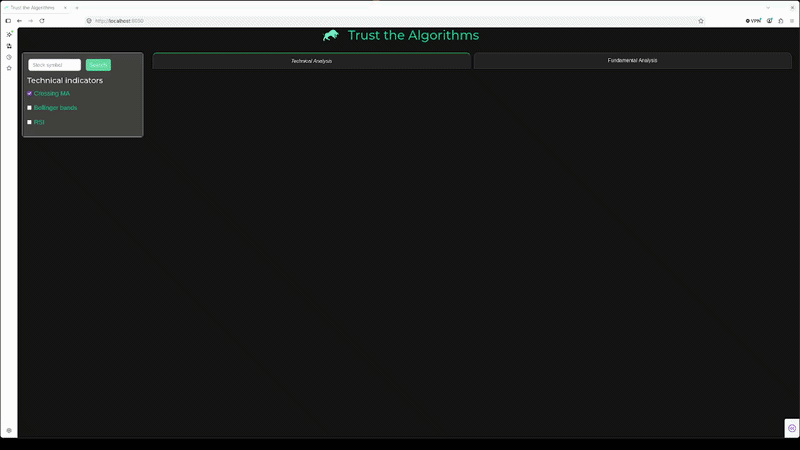
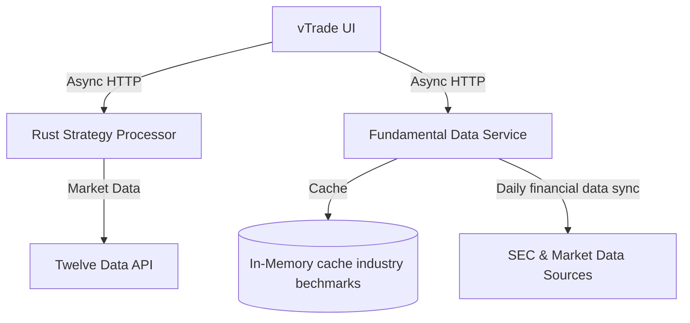

# vTrade

  

  <strong>Next-Generation Algorithmic Backtesting & Fundamental Equity Analysis Platform</strong>

  
  
  
  
  

---

The standard 50-day and 200-day Simple Moving Average (SMA) combination doesn't work for every stock. That's where **vTrade** comes in. 

Powered by a blazing-fast [Rust strategy processor](https://github.com/viettran295/strategy-processor), **vTrade** lets investors backtest countless technical indicator parameter combinations to find the absolute best settings for any given stock. In addition, vTrade pairs quantitative technical strategy with in-depth fundamental balance sheet, income statement, cash flow and industry benchmark powered by the [Fundamental Service](https://github.com/viettran295/fundamental).

---

## Key Features

### 1. Technical Analysis
- **Moving Average Crossover (SMA / EMA)**:
  - Custom Short and Long Moving Average parameter windows.
  - Interactive Candlestick charts with MA overlays and explicit Buy/Sell execution markers.
  - **1-Click "Best Performance" Optimization**: the Rust backend to compute optimal parameter pairs for maximum historical yield.
- **Relative Strength Index (RSI)**:
  - Momentum oscillator with overbought (70) and oversold (30) threshold tracking.
- **Bollinger Bands (BB)**:
  - Volatility-based trading bands (Upper, Lower, Middle SMA) with entry/exit indicators.

### 2. Fundamental Analysis & Industry Benchmarks
- **Daily SEC Data Sync**:
  - Automatically syncs SEC data daily to keep financial statements up-to-date.
- **Financial Statement Visualization**:
  - Detailed asset and liability breakdowns (Current Assets, Inventory, Current Liabilities, Net Working Capital, Total Assets, Total Liabilities).
  - Annual/Quarterly breakdown of Revenue, Net Income, Gross Profit, and Operating Expenses.
  - Cash flow breakdown: Operating Cash Flow, Financing Cash Flow, Investing, and Free Cash Flow (FCF).
- **Financial Ratios vs. Industry Benchmarks**:
  - Compare company financial ratios against industry benchmarks.
  - Liquidity (Current Ratio, Quick Ratio), Solvency/Leverage (Debt-to-Equity, Debt-to-Assets).

---

## Architecture Overview

```mermaid
graph TD
    UI[vTrade UI] -->|Async HTTP | SP[Rust Strategy Processor]
    UI -->|Async HTTP | FA[Fundamental Data Service]
    FA -->|Cache | DF[(In-Memory cache industry bechmarks)]
    SP -->|Market Data| TD[Twelve Data API]
    FA -->|Daily financial data sync| SEC[SEC & Market Data Sources]
```

- **Frontend / Dashboard (`vtrade`)**: Python, Dash, Plotly, Dash Bootstrap Components.
- **Strategy Processor (`strategy-processor`)**: High-performance Rust backend for strategy parameter grid searches.
- **Fundamental Service (`fundamental`)**: Backend service that syncs SEC financial data daily for financial statements and ratios.
- **In-Memory Cache (`dragonfly`)**: High-throughput Redis-compatible caching layer.

## Related Repositories

- [Strategy Processor](https://github.com/viettran295/strategy-processor) — High-speed backtesting and parameter optimization engine.
- [Fundamental Service](https://github.com/viettran295/fundamental) — Sync SEC data daily for financial statement and industry benchmark analysis.

